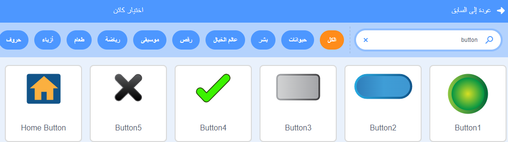
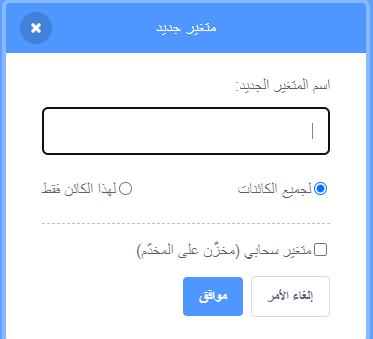

أضف كائنًا ليكون بمثابة زر.


**Tip:** any sprite could be a button but there are already some button sprites in Scratch that you can use.



Click on the `Variables`{:class="block3variables"} Blocks menu and select the **Make a Variable** button.

امنح المتغير ``{: class = "block3variables"} اسمًا يسهل التعرف عليه.



You will need to add code to your button sprite to update the `variable`{:class="block3variables"}. يمكنك:

+ استخدم زر لتعيين ``{: class = "block3variables"} المتغير ``{: class = "block3variables"} إلى قيمة جديدة.

```blocks3
when this sprite clicked
set [speed v] to (10)
```

+ Use the button to `change`{:class="block3variables"} the existing value in a `variable`{:class="block3variables"} by a new amount.

```blocks3
when this sprite clicked
change [score v] by (1)
```

+ استخدم زر`اسال`{: فئة = "block3sensing"} سؤال و `لجعل`{: فئة = "block3variables"} قيمة `المتغير`{: فئة = "block3variables"} إلى `الجواب`{: فئة = "block3sensing"}.

```blocks3
when this sprite clicked
ask [What is your name?] and wait 
set [name v] to (answer)
```
