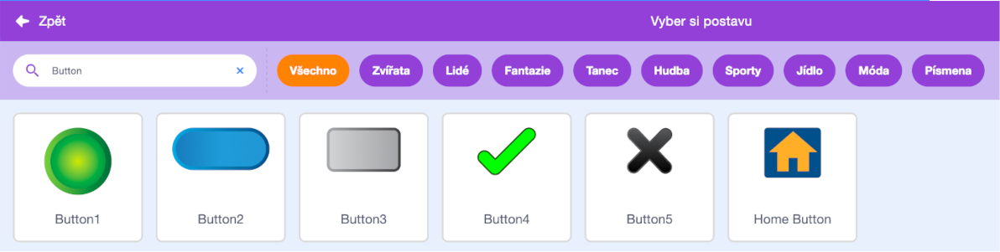
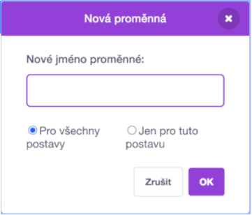

Přidejte postavu, která bude fungovat jako tlačítko.


**Tip:** libovolná postava může být tlačítko, ale ve Scratch již existuje několik tlačítkových postav, které můžete použít.



Klikněte na nabídku `Proměnné`{:class="block3variables"} a vyberte tlačítko **Vytvoř proměnnou**.

Dej `proměnné`{:class="block3variables"} název, který bude snadno rozpoznatelný.



Chceš-li aktualizovat `proměnnou`{:class="block3variables"}, budeš muset přidat kód do své postavy, kterou používáš jako tlačítko. Například:

+ Pomocí tlačítka `nastav`{:class="block3variables"} můžeš změnit hodnotu `proměnné`{:class="block3variables"}.

```blocks3
when this sprite clicked
set [rychlost v] to (10)
```

+ Pomocí tlačítka `změň`{:class="block3variables"} můžeš nastavit hodnotu existující `proměnné`{:class="block3variables"}.

```blocks3
when this sprite clicked
change [skóre v] by (1)
```

+ Pomocí tlačítka `ukaž proměnnou`{:class="block3sensing"} se zeptáš a pomocí `nastav`{:class="block3variables"} nastavíš `proměnnou`{:class="block3variables"} na `odpověď`{:class="block3sensing"}.

```blocks3
when this sprite clicked
ask [Jak se jmenuješ?] and wait 
set [jméno v] to (odpověď)
```
