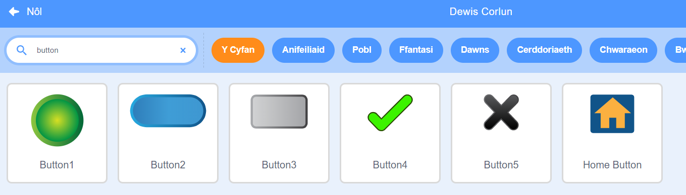

Ychwanegu corlun i weithredu fel botwm.


**Awgrym:** mae unrhyw gorlun yn gallu bod yn fotwm, ond mae rhai corluniau botwm yn Scratch eisoes y galli di eu defnyddio.



Clicia ar y ddewislen Blociau `Newidynnau`{:class="block3variables"} a dewis y botwm **Creu Newidyn**.

Rho enw i'r `newidyn`{:class="block3variables"} sy'n hawdd i'w adnabod.


Bydd angen i ti ychwanegu cod at dy gorlun botwm i ddiweddaru'r `newidyn`{:class="block3variables"}. Gallet ti:

+ Defnyddio'r botwm i `osod`{:class="block3variables"} y `newidyn`{:class="block3variables"} i werth newydd.

```blocks3
when this sprite clicked
set [cyflymder v] to (10)
```

+ Defnyddio'r botwm i `newid`{:class="block3variables"} y gwerth sy'n bodoli mewn `newidyn`{:class="block3variables"} i werth newydd.

```blocks3
when this sprite clicked
change [sgôr v] by (1)
```

+ Defnyddio'r botwm i `ofyn`{:class="block3sensing"} cwestiwn a `gosod`{:class="block3variables"} y `newidyn`{:class="block3variables"} i'r `ateb`{:class="block3sensing"}.

```blocks3
when this sprite clicked
ask [Beth yw dy enw?] and wait 
set [enw v] to (answer)
```
