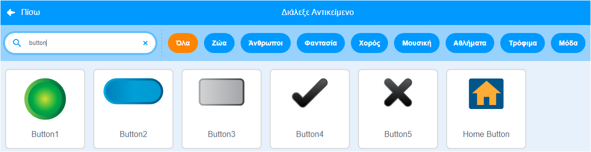
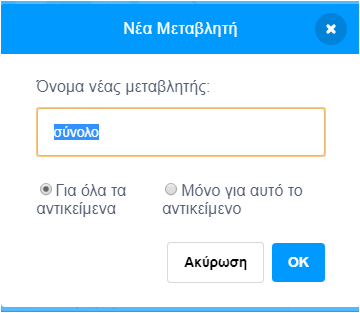

Πρόσθεσε ένα αντικείμενο που θα λειτουργεί ως κουμπί.


**Συμβουλή:** οποιοδήποτε αντικείμενο θα μπορούσε να είναι ένα κουμπί, αλλά υπάρχουν ήδη κάποια αντικείμενα κουμπιών στο Scratch που μπορείς να χρησιμοποιήσεις.



Κάνε κλικ στο μενού `Μεταβλητές`{:class="block3variables"} και επίλεξε το κουμπί **Δημιουργία μεταβλητής**.

Δώσε ένα όνομα στη `μεταβλητή `{:class="block3variables"} που να είναι εύκολο να αναγνωριστεί.



Θα χρειαστεί να προσθέσεις κώδικα στο κουμπί του αντικειμένου για να ενημερώσεις τη `μεταβλητή`{:class="block3variables"}. Θα μπορούσες να:

+ Χρησιμοποίησε το κουμπί για να`ορίσεις`{:class="block3variables"} μια νέα τιμή στη`μεταβλητή`{:class="block3variables"}.

```blocks3
when this sprite clicked
set [speed v] to (10)
```

+ Χρησιμοποίησε το κουμπί για να`αλλάξεις`{:class="block3variables"} την υπάρχουσα τιμή στη`μεταβλητή`{:class="block3variables"} κατά ένα ποσό.

```blocks3
when this sprite clicked
change [score v] by (1)
```

+ Χρησιμοποίησε το κουμπί για να `ρωτήσεις`{:class="block3sensing"} μια ερώτηση και `δώσε`{:class="block3variables"} στη `μεταβλητή`{:class="block3variables"} την τιμή της `απάντησης`{:class= "block3sensing"}.

```blocks3
when this sprite clicked
ask [What is your name?] and wait 
set [name v] to (answer)
```
