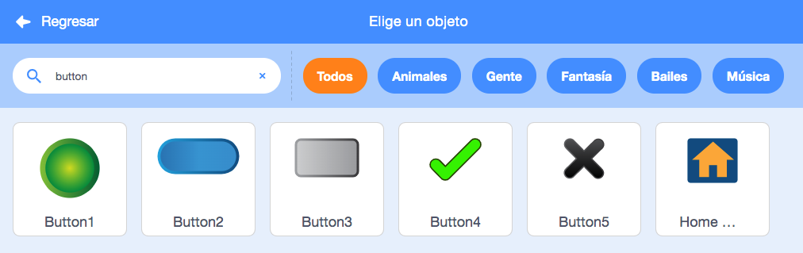
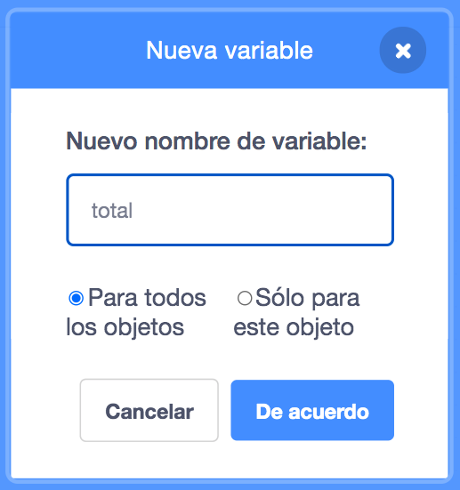

Agrega un objeto para que actúe como botón.


**Consejo:** cualquier objeto puede ser un botón, pero ya hay algunos objetos de botón en Scratch que puedes usar.



Haz clic en el Menú de bloques `Variables`{:class="block3variables"} y selecciona el botón **Crear una variable**.

Dale un nombre a tu `variable`{:class="block3variables"} que sea fácil de reconocer.



Necesitarás agregar código a tu objeto de botón para actualizar la `variable`{:class="block3variables"}. Tú podrías:

+ Usar el botón para `fijar`{:class="block3variables"} la `variable`{:class="block3variables"} con un nuevo valor.

```blocks3
when this sprite clicked
set [speed v] to (10)
```

+ Usar el botón para `cambiar`{:class="block3variables"} el valor existente en una `variable`{:class="block3variables"} por una nueva cantidad.

```blocks3
when this sprite clicked
change [score v] by (1)
```

+ Usar el botón para `hacer`{:class="block3sensing"} una pregunta y `fijar`{:class="block3variables"} la `variable`{:class="block3variables"} a la `respuesta`{:class="block3sensing"}.

```blocks3
when this sprite clicked
ask [What is your name?] and wait 
set [name v] to (answer)
```
