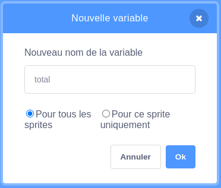

Ajouter un sprite pour agir comme un bouton.


**Astuce :** n'importe quel sprite peut être un bouton, mais il existe déjà des sprites de bouton dans Scratch que tu peux utiliser.


Clique sur le menu blocs `Variables`{:class="block3variables"} et sélectionne le bouton **Créer une variable**.

Donne à la `variable `{:class="block3variables"} un nom facile à reconnaître.



Tu devras ajouter du code à ton sprite de bouton pour mettre à jour la `variable`{:class="block3variables"}. Tu pourrais :

+ Utiliser le bouton `mettre`{:class="block3variables"} la `variable`{:class="block3variables"} à une nouvelle valeur.

```blocks3
when this sprite clicked
set [speed v] to (10)
```

+ Utiliser le bouton `pour ajouter`{:class="block3variables"} à la valeur existante d'une `variable`{:class="block3variables"} un nouveau montant.

```blocks3
when this sprite clicked
change [score v] by (1)
```

+ Utiliser le bouton pour `poser`{:class="block3sensing"} une question et `mettre`{:class="block3variables"} la `variable`{:class="block3variables"} à la `réponse`{:class= "block3sensing"}.

```blocks3
when this sprite clicked
ask [What is your name?] and wait 
set [name v] to (answer)
```
