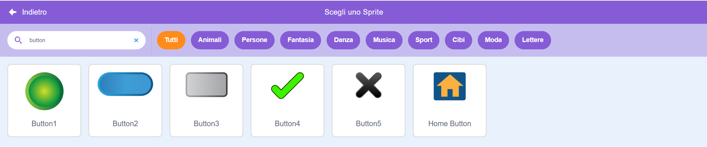
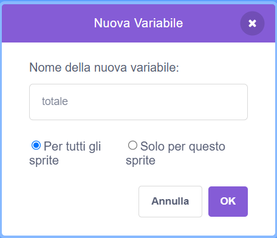

Aggiungi uno sprite da usare come pulsante.


**Suggerimento:** qualsiasi sprite può diventare un pulsante, ma in Scratch trovi già alcuni sprite pronti da usare come pulsanti.



Fai clic sul menu dei blocchi `Variabili`{:class="block3variables"} e seleziona il pulsante **Crea una Variabile**.

Assegna alla `variabile`{:class="block3variables"} un nome facile da riconoscere.



Dovrai aggiungere del codice allo sprite del pulsante per aggiornare la `variabile`{:class="block3variables"}. Potresti:

+ Usare il pulsante per `impostare`{:class="block3variables"} la `variabile`{:class="block3variables"} su un nuovo valore.

```blocks3
when this sprite clicked
set [speed v] to (10)
```

+ Usa il pulsante per `modificare`{:class="block3variables"} il valore esistente in una `variabile`{:class="block3variables"} aggiungendo un nuovo valore.

```blocks3
when this sprite clicked
change [score v] by (1)
```

+ Usa il pulsante per `fare`{:class="block3sensing"} una domanda e `impostare`{:class="block3variables"} la `variabile`{:class="block3variables"} sulla `risposta`{:class="block3sensing"}.

```blocks3
when this sprite clicked
ask [What is your name?] and wait 
set [name v] to (answer)
```
