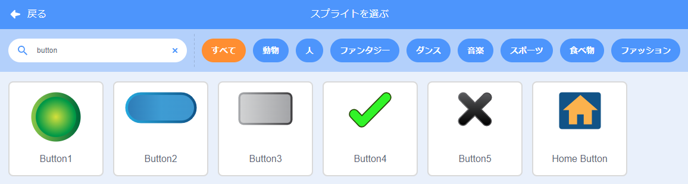
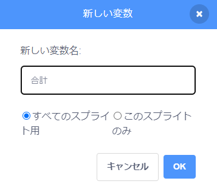

ボタンとして機能するスプライトを追加します。


**ヒント:** どのスプライトもボタンにすることができますが、Scratchには使用できるボタンのスプライトが既にいくつかあります。



`変数`{:class="block3variables"}ブロックメニューをクリックして、**変数を作る**ボタンを選びます。

`変数`{:class="block3variables"}にわかりやすい名前を付けます。



`変数`{:class="block3variables"}を更新するには、ボタンのスプライトにコードを追加する必要があります。 こんなことができます。

+ ボタンを使用して、`変数`{:class="block3variables"}を新しい値に`設定`{:class="block3variables"}します。

```blocks3
when this sprite clicked
set [speed v] to (10)
```

+ ボタンを使用して、`変数`{:class="block3variables"}の現在の値を新しい値ずつ`変え`{:class="block3variables"}ます。

```blocks3
when this sprite clicked
change [score v] by (1)
```

+ ボタンを使用して、質問を`聞いて`{:class="block3sensing"}、`変数`{:class="block3variables"}をその`答え`{:class="block3sensing"}に`設定`{:class="block3variables"}します。

```blocks3
when this sprite clicked
ask [What is your name?] and wait 
set [name v] to (answer)
```
