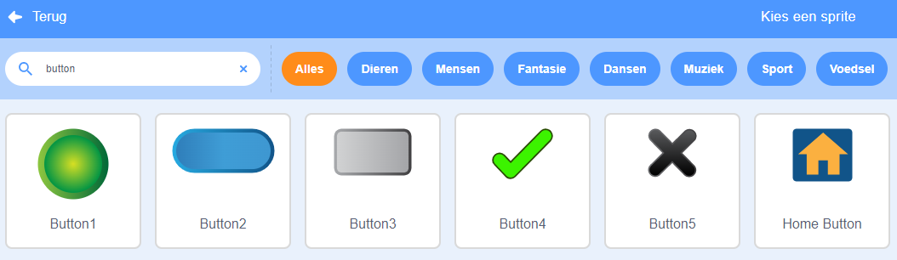
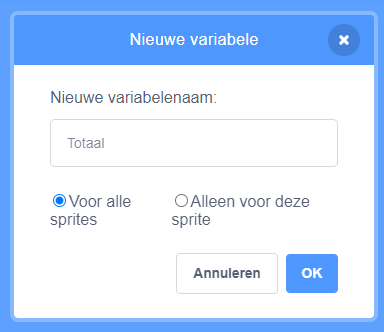

Voeg een sprite toe om als knop te fungeren.


**Tip:** elke sprite kan een knop zijn, maar er zijn al enkele knop-sprites in Scratch die je kunt gebruiken.



Klik op het `Variabelen`{:class="block3variables"} blokkenmenu en selecteer de **Maak een Variabele** knop.

Geef de `variabele`{:class="block3variables"} een naam die gemakkelijk te herkennen is.



Je moet code aan je knop sprite toevoegen om de `variabele`{:class="block3variables"} bij te werken. Je zou:

+ De knop kunnen gebruiken om de `variabele`{:class="block3variables"} met `maak`{:class="block3variables"} op een nieuwe waarde in te stellen.

```blocks3
when this sprite clicked
set [snelheid v] to (10)
```

+ De knop kunnen gebruiken om de `variabele`{:class="block3variables"} met `verander`{:class="block3variables"} met een bepaalde waarde te veranderen.

```blocks3
when this sprite clicked
change [score v] by (1)
```

+ De knop kunnen gebruiken om een `vraag`{:class="block3sensing"} te stellen en met `maak`{:class="block3variables"} de `variabele`{:class="block3variables"} op het `antwoord`{:class="block3sensing"} in te stellen.

```blocks3
when this sprite clicked
ask [Hoe heet jij?] and wait 
set [naam v] to (answer)
```
