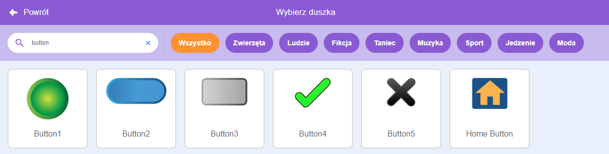
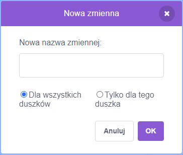

Dodaj duszka, który będzie pełnił funkcję przycisku.


**Wskazówka:** każdy duszek może być przyciskiem, ale w Scratchu istnieje już kilka duszków przycisków, których możesz użyć.



Kliknij `Zmienne`{:class="block3variables"} w menu Bloki i wybierz przycisk **Utwórz zmienną**.

Nadaj `zmiennej`{:class="block3variables"} łatwą do rozpoznania nazwę.



Będziesz musiał dodać kod do ikonki Twojego przycisku (duszka), aby zaktualizować `zmienną`{:class="block3variables"}. Możesz:

+ Użyć przycisku, aby `ustawić`{:class="block3variables"} `moją zmienną`{:class="block3variables"} na nową wartość.

```blocks3
when this sprite clicked
set [prędkość v] to (10)
```

+ Użyć przycisku, aby `zmienić`{:class="block3variables"} `wynik`{:class="block3variables"} na nową wartość.

```blocks3
when this sprite clicked
change [wynik v] by (1)
```

+ Użyć przycisku, aby `zapytać`{:class="block3sensing"} i `ustawić`{:class="block3variables"} `zmienną`{:class="block3variables"} na `odpowiedź`{:class="block3sensing"}.

```blocks3
when this sprite clicked
ask [Jak masz na imię?] and wait 
set [imię v] to (answer)
```
