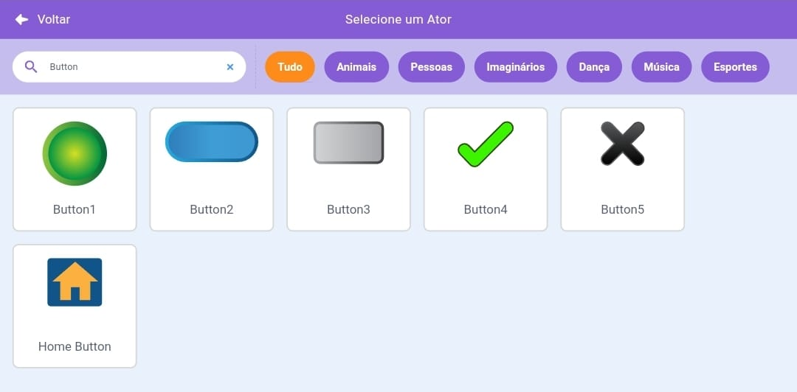
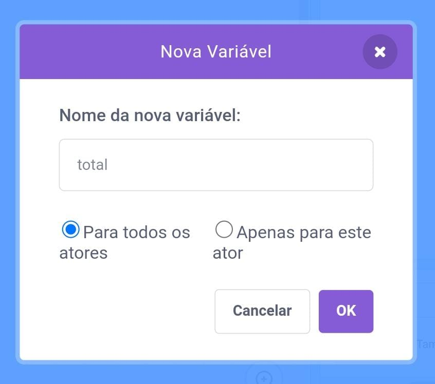

Adicione um sprite para atuar como um botão.


**Dica:** qualquer sprite pode ser um botão, mas já existem alguns sprites de botão no Scratch que você pode usar.



Clique no menu `Variáveis`{:class="block3variables"} Blocos e selecione o botão **Criar uma variável**.

Dê à `variável `{:class="block3variables"} um nome que seja fácil de reconhecer.



Você precisará adicionar código ao seu sprite de botão para atualizar a `variável`{:class="block3variables"}. Você poderia:

+ Use o botão para `definir`{:class="block3variables"} a `variável`{:class="block3variables"} para um novo valor.

```blocks3
when this sprite clicked
set [speed v] to (10)
```

+ Use o botão para `alterar`{:class="block3variables"} o valor existente em uma `variável`{:class="block3variables"} por uma nova quantia.

```blocks3
when this sprite clicked
change [score v] by (1)
```

+ Use o botão para `perguntar`{:class="block3sensing"} a questão e `definir`{:class="block3variables"} a `variável`{:class="block3variables"} na `resposta`{:class="block3sensing"}.

```blocks3
when this sprite clicked
ask [What is your name?] and wait 
set [name v] to (answer)
```
