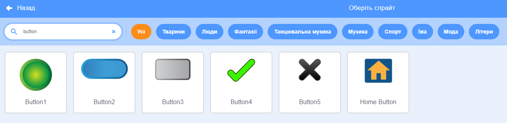
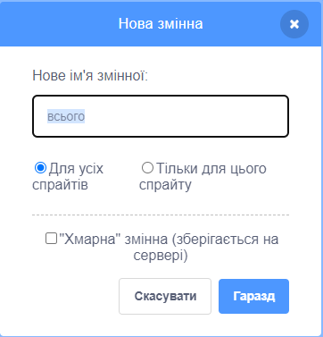

Додай спрайт, який буде виконувати роль кнопки.


**Порада:** будь-який спрайт може бути кнопкою, але у Scratch передбачено кілька спрайтів кнопок, які можна використовувати.



Натисни на меню Блоків `Змінні`{:class="block3variables"} та вибери кнопку **Створити змінну**.

Дай `змінній`{:class="block3variables"} назву, яку легко зрозуміти.



Тобі потрібно буде додати код до кнопки спрайта, щоб оновити `змінну`{:class="block3variables"}. Ти можеш:

+ Використовуй кнопку `надати`{:class="block3variables"}, щоб встановити `змінній`{:class="block3variables"} нове значення.

```blocks3
when this sprite clicked
set [speed v] to (10)
```

+ Використовуй кнопку `змінити`{:class="block3variables"}, щоб змінити поточне значення в `змінній`{:class="block3variables"} на іншу суму.

```blocks3
when this sprite clicked
change [score v] by (1)
```

+ Використовуй кнопку `запитати`{:class="block3sensing"}, щоб поставити питання та кнопку `надати`{:class="block3variables"} `змінну`{:class="block3variables"} до `відповіді`{:class="block3sensing"}.

```blocks3
when this sprite clicked
ask [What is your name?] and wait 
set [name v] to (answer)
```
